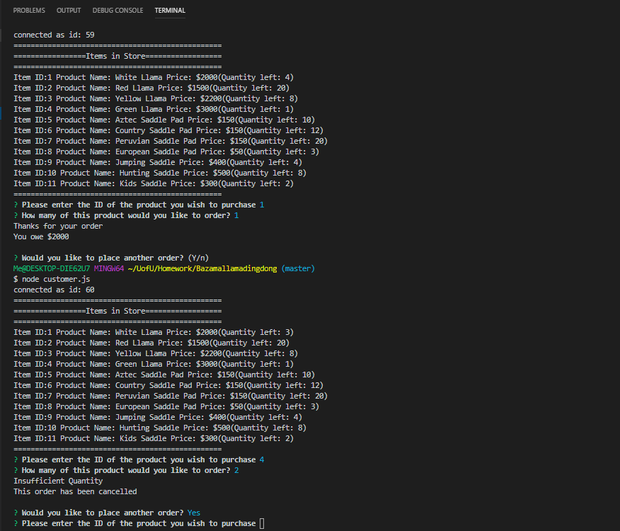

# Bazamallamadingdong

An interactive storefront that runs in the console using node.  

#How It Works

##Bazamallamadingdong Customer
Customer.js, allows a "customer" to place an order from the Bazamallamadingdong store.  A check is then performed on the store inventory and the customer is either alerted that their order cannot be completed, or they are shown the total amount owed (but no credit card number is requested).  Behind the scenes, the quantity ordered by the customer is deducted from the store quantity (which is stored in a SQL table).  

###Customer.js Screenshot

